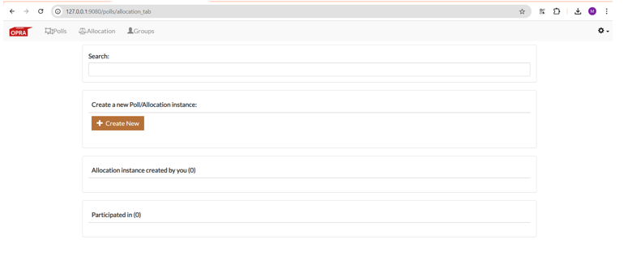
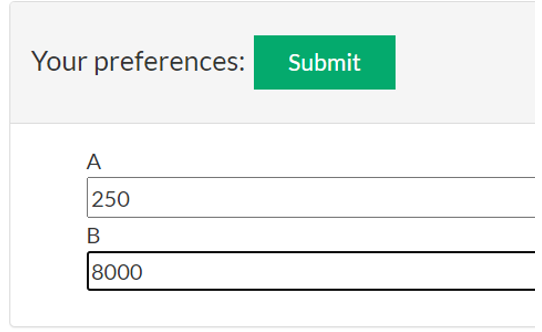
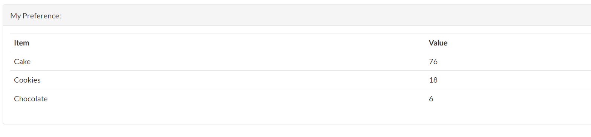
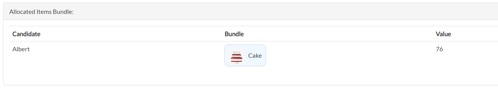

# Allocations

* Click on “Allocation” tab on the top left of the page to go to the page mentioned below.
* You can create a new allocation instance by clicking on “Create New” button and complete the configuration steps.
* Under the section of “Allocation instance created by you”, you will see all the allocation instances that you have created. 
* Under the section of “Participated in”, you can see the Allocation instances that you are invited to participate in.
* You can search all the allocation instance created by you in the top search box and filter it out based on key word in the name of the Poll.

## Allocation Creation
* The Allocation creation is same as the Poll creation.
* The difference is, select question type as “Allocation”
* There are some differences at step 4. The following slide explains about the differences.

### Allocation creation – step 4 - Algorithms:
1. As of now, only one Allocation algorithm is implemented. Hence the UI looks like below.
2. Only 3 options to submit allocation preferences and they cannot co-exist in a same instance. Hence the radio buttons in the selection of UI.
3. The following info is shown in Results page of Allocation based on the selection.

## Allocation Settings
* The Allocation settings pages are similar to Poll Settings page.

## UI to get preferences 

### Budget UI
1. Sliders to submit preferences, but cumulative score can’t exceed 100. 

### List UI
1. Numbers to submit preferences, but cumulative score can’t exceed 100. 

### Infinite Budget UI
1. Numbers to submit preferences, but  o upper limit for cumulative score. 

## Allocation Results

### Own Prefereneces
1. Displays the user's preferences for the current Allocation instance.

### Allocated Item Bundle

### Allocation results

### EF1 Matrix

